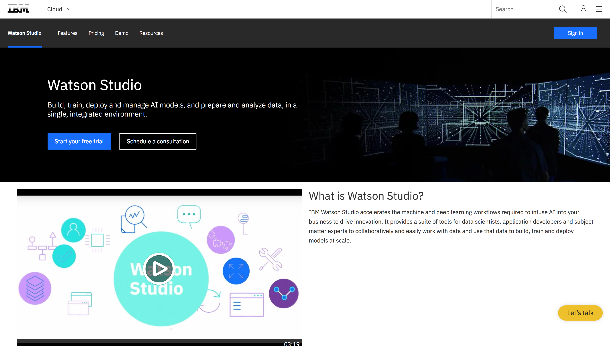
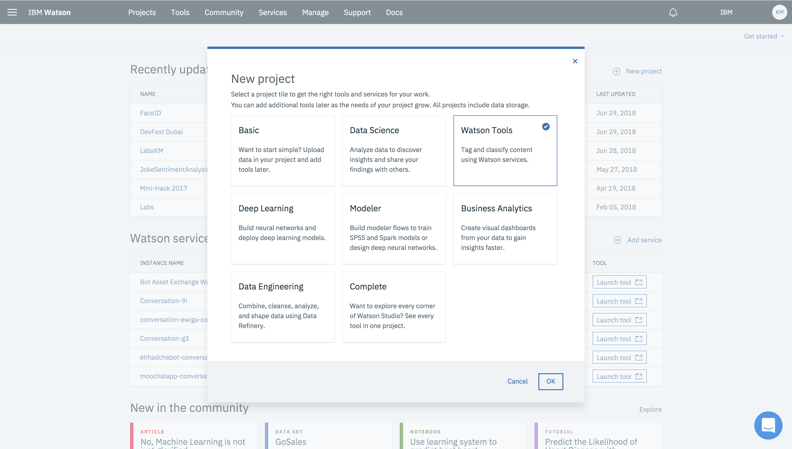
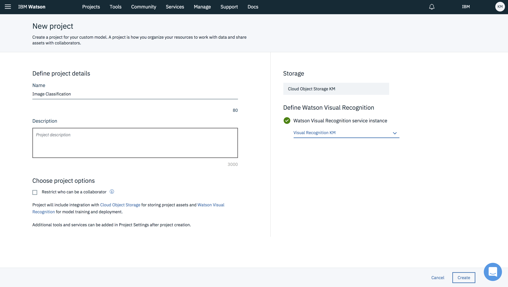
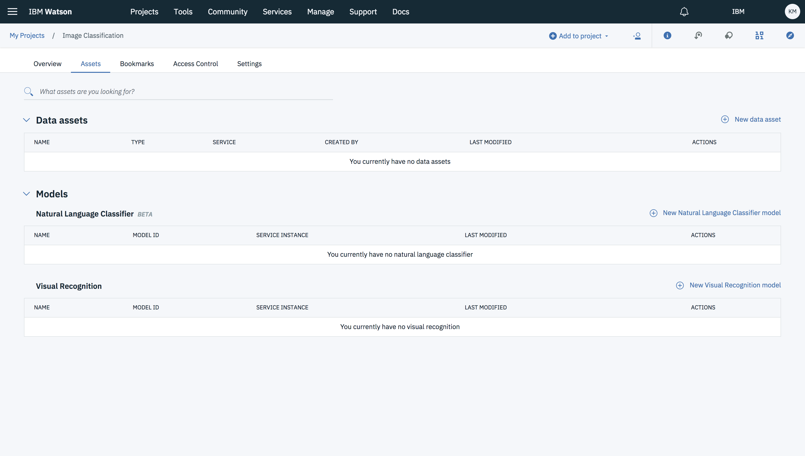
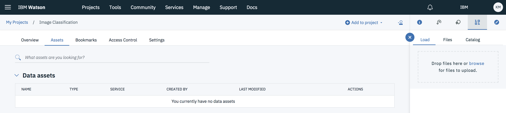
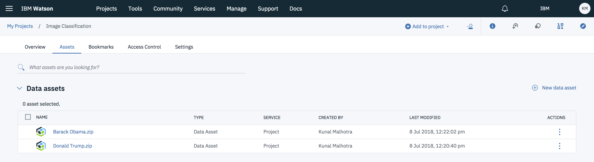

In recent years, one of the biggest applications of machine learning has been in image classification — the ability for a computer to intelligently recognize an object. Such work is being done at the greatest technology companies, and it’s since spawned this unwarranted notion of exclusivity. We’ve crafted a narrative that in order to get your hands dirty with machine learning and artificial intelligence, you have to be some sort of certifiable genius, or at least an engineering graduate just to break in. I think that’s bullshit, so I’m going to to show you how in less than 10 minutes, you can build a fully-functioning image classifier that can recognize any (yes, any) object with insanely high probabilities.

## Learning objectives

After completing this how-to, the reader will be able to:

* Learn Watson Studio to build a image classification model using image data from any source.
* Build an android application which classify images using the model.

## Prerequisites

* IBM Cloud account - [sign up](https://console.bluemix.net/registration/) if you don't have an account yet.

* Enough space on IBM Cloud for 3 services. If not, delete some services to make room.

* You will require Android Studio, download the latest version [Android Studio 3.1.3](https://developer.android.com/studio/)

* Install [JAVA JDK SE 8](http://www.oracle.com/technetwork/java/javase/downloads/jdk8-downloads-2133151.html)

* A dataset that you want to model.

    If you don't have your own dataset, then you can download this [Sample Dataset](https://github.com/sudoalgorithm/Developing-A-Image-Classifier-Using-Watson-Visual-Recognition-On-Watson-Studio-Dataset.git)

## Estimated time

To complete this how-to it should take around 45 minutes.

## Steps

### Setting up Watson Studio for first time

Watson Studio is a cloud based development and deployment environment for Machine Learning, Deep Learning, Data Governance and Data Expolaration. A platform build for business analyst, data engineer, data scientist and developer to simply there task with an intuitive UI and provide massive computing power. A platform where insights can be traced back to models, projects, notebooks and data sources and where model can evolve and automatically update themselves.

* Navigate to [datascience.ibm.com](https://www.ibm.com/cloud/watson-studio)

* Sign in on the IBM Cloud

### Get Started on Watson Studio

* Click on **Get Started** and you will be redirected to the Watson Studio dashboard.

* An interactive menu will be shown **Get started with key tasks**.

### Create Project

* Click on New Project and select **Watson Tools**.

* On selecting **Watson Tools** project tile, two services i.e **Object Storage** and **Watson Visual Recognition** will be created in your IBM cloud dashboard.

* Enter **Project Name**, **details** (optional), choosing **Restrict who can be a collaborator** (optional). Notice on the side that **Object Storage** and **Watson Visual Recognition** services are selected.

* If by some error in the server they are not created, they can be added from the drop-down list too via Watson Studio.
* Project dashboard will be shown. That will have tabs like **Overview**, **Assets**, **Bookmarks**, **Access Control**, **Settings**.
* Select the **Assets** tab.

### Add data asset

* Click on **New data asset**.
* A side navigation drawer will open with **Load** tab selected.

* Click on **browse** or simply **drag and drop** the data assets of your project.
    (Note:- In case of Watson Visual Recognition project, have your data assets in a zip file).

### Create a Model

